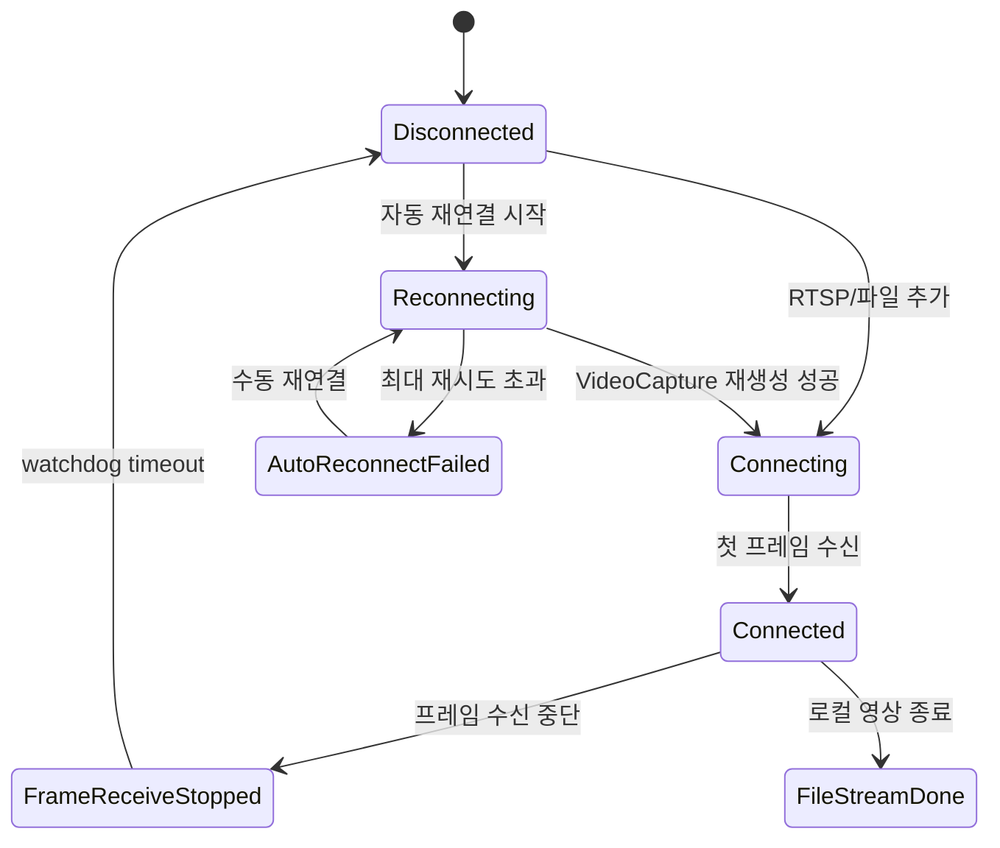

# Drone Detector

WPF 기반의 실시간 드론 탐지 데모 애플리케이션입니다. RTSP 스트림 또는 로컬 영상 파일을 입력받아 OpenCV로 프레임을 수신하고, ONNX Runtime 기반 YOLO 모델로 드론을 탐지한 뒤 결과를 UI에 표시합니다.

이 프로젝트는 단순 이미지 추론 데모가 아니라, 실시간 영상 입력에서 발생할 수 있는 연결 끊김, 재연결, 상태 표시, 자원 정리 같은 운영성 문제까지 다루는 것을 목표로 만들었습니다.

## 주요 기능

- RTSP 주소 또는 로컬 영상 파일 입력
- 실시간 영상 표시 및 YOLO 바운딩 박스 오버레이
- 카메라 리스트, 선택, 삭제
- 카메라별 썸네일 표시
- 해상도/FPS 정보 표시
- 드론 탐지 결과 표시
- ONNX Runtime GPU 추론 및 CPU fallback
- 프레임 수신 중단 감지 watchdog
- 자동 재연결 및 수동 재연결
- 연결 상태 문구와 상태등 UI
- 재연결/삭제 작업 경쟁 상태 방지
- 추론 단계별 처리 시간 CSV 로깅
- 앱 종료 시 카메라/추론 자원 정리

## 기술 스택

- C# / .NET 8
- WPF
- CommunityToolkit.Mvvm
- OpenCvSharp
- ONNX Runtime GPU
- YOLO ONNX model

## 실행 환경

### 필수 환경

- Windows 10/11 64-bit
- .NET 8 SDK 또는 .NET 8 Desktop Runtime
- NVIDIA CUDA를 지원하는 GPU
- 최신 NVIDIA 그래픽 드라이버
- CUDA Toolkit
- cuDNN
- Microsoft Visual C++ Redistributable 2015-2022 (x64)

이 프로젝트는 `Microsoft.ML.OnnxRuntime.Gpu 1.26.0`을 사용합니다. CUDA와 cuDNN의 메이저 버전이 ONNX Runtime GPU 패키지와 호환되어야 합니다. 현재 ONNX Runtime CUDA Execution Provider는 CUDA 12.x와 cuDNN 9.x 조합을 기준으로 제공되므로, 설치 전 반드시 공식 호환표를 확인하세요.

- [ONNX Runtime CUDA Execution Provider 요구사항](https://onnxruntime.ai/docs/execution-providers/CUDA-ExecutionProvider.html#requirements)
- [NVIDIA CUDA Toolkit 다운로드](https://developer.nvidia.com/cuda-downloads)
- [NVIDIA cuDNN 설치 가이드](https://docs.nvidia.com/deeplearning/cudnn/installation/latest/)
- [Microsoft Visual C++ Redistributable](https://learn.microsoft.com/cpp/windows/latest-supported-vc-redist)

### CUDA 및 cuDNN DLL

`Microsoft.ML.OnnxRuntime.Gpu` NuGet 패키지는 ONNX Runtime의 GPU 실행 파일을 포함하지만, NVIDIA CUDA/cuDNN 런타임 DLL은 실행 PC에 별도로 준비되어 있어야 합니다.

1. CUDA Toolkit을 설치합니다.
2. 호환되는 cuDNN을 다운로드하고 설치합니다.
3. CUDA와 cuDNN의 `bin` 경로가 Windows `PATH`에 포함되어 있는지 확인합니다.
4. 실행 시 `cudart64_*.dll`, `cublas64_*.dll`, `cublasLt64_*.dll`, `cudnn64_9.dll` 등의 DLL을 찾을 수 있어야 합니다.
5. 앱 실행 로그에서 `GPU 연결 성공`을 확인합니다.

CUDA 초기화 또는 DLL 로드에 실패하면 앱은 CPU Execution Provider로 전환됩니다. CPU fallback은 실행 안정성을 위한 기능이며, GPU 추론보다 처리 속도가 낮을 수 있습니다.

설치 확인 예시:

```powershell
nvidia-smi
nvcc --version
where.exe cudnn64_9.dll
```

`nvcc`는 CUDA Toolkit 설치 여부를 확인하며, 그래픽 드라이버의 CUDA 지원 버전은 `nvidia-smi`에서 확인할 수 있습니다.

### GPU 성능 권장 설정

노트북이나 절전 설정이 적용된 PC에서는 GPU 클럭이 낮아져 추론 시간이 불안정할 수 있습니다. 데모 또는 성능 측정 시 다음 설정을 권장합니다.

1. NVIDIA 제어판을 실행합니다.
2. `3D 설정 관리`의 `프로그램 설정`에서 이 애플리케이션을 선택합니다.
3. `전원 관리 모드`를 `최대 성능 선호`로 설정합니다.
4. 노트북에서는 Windows 전원 모드를 `최고 성능`으로 설정하고 전원 어댑터를 연결합니다.
5. 내장/외장 GPU 선택이 가능한 환경에서는 Windows 그래픽 설정에서 앱을 `고성능` GPU로 지정합니다.

전역 설정을 변경하기보다 프로그램별 설정을 사용하는 것을 권장합니다.

## 프로젝트 구조

```text
YoloWithWPF/
  Enums/
    CameraOperationResult.cs
    ConnectStatusEnum.cs
  Models/
    CameraStreamItem.cs
  Services/
    CameraService.cs
    InferenceCsvLogger.cs
    YoloService.cs
  ViewModels/
    MainViewModel.cs
  Views/
    RtspDialog.xaml
  Resources/
    MainStyles.xaml
  MainWindow.xaml
  new_best.onnx
```

## 핵심 설계

### CameraService

`CameraService`는 영상 입력을 담당합니다.

- `VideoCapture` 생성 및 프레임 수신
- RTSP/로컬 파일 처리 분기
- 마지막 프레임 수신 시간 기반 watchdog
- 자동 재연결 시도
- 카메라 삭제/재연결 작업 경쟁 방지
- 프레임, 썸네일, 카메라 정보, 연결 상태 이벤트 발행

### YoloService

`YoloService`는 ONNX 모델 추론을 담당합니다.

- 입력 프레임 resize 및 tensor 변환
- ONNX Runtime 추론 실행
- 후처리 및 NMS
- target class 필터링
- 추론 시간 CSV 로깅

### MainViewModel

`MainViewModel`은 UI와 서비스 사이의 상태를 조율합니다.

- 카메라 추가/선택/삭제/재연결 command
- 현재 프레임 표시
- 탐지 결과 표시
- 연결 상태 UI 반영
- 앱 종료 시 서비스 자원 정리

## 연결 상태 흐름



## RTSP와 로컬 파일 처리 차이

RTSP 스트림은 네트워크 단절 가능성이 있으므로 프레임 수신이 멈추면 watchdog이 상태를 감지하고 재연결을 시도합니다.

로컬 영상 파일은 EOF가 정상 종료이므로 자동 재연결하지 않고 `파일 스트림 완료` 상태로 전환합니다. 이후 사용자가 카메라 목록에서 삭제할 수 있습니다.

## 실행 방법

1. Visual Studio 또는 .NET CLI 환경에서 솔루션을 엽니다.
2. `new_best.onnx`가 프로젝트에 포함되어 있는지 확인합니다.
3. 빌드합니다.

```powershell
dotnet build YoloWithWPF.sln
```

4. 앱을 실행한 뒤 `+ RTSP 추가` 버튼으로 RTSP 주소 또는 영상 파일 경로를 입력합니다.

ONNX 모델은 `.csproj` 설정에 의해 빌드 출력 폴더로 복사되며, 실행 시 `AppContext.BaseDirectory` 기준으로 로드됩니다.

## 검증 시나리오

### 로컬 영상

- 로컬 mp4 파일 추가
- 영상 재생 및 탐지 결과 표시 확인
- 영상 종료 후 `파일 스트림 완료` 상태 확인
- 삭제 버튼으로 목록 제거 확인

### RTSP 정상 연결

- RTSP 주소 추가
- 첫 프레임 수신 후 `연결됨` 상태 확인
- 상태등 초록색 표시 확인
- 썸네일 및 메인 영상 갱신 확인

### RTSP 단절

- 네트워크 단절 또는 RTSP 송출 중단
- 일정 시간 후 `영상 끊김` 또는 `연결 끊김` 상태 확인
- 자동 재연결 시도 횟수 표시 확인
- 최대 재시도 초과 시 `자동 재연결 실패`와 재연결 버튼 표시 확인

### 수동 재연결

- RTSP 송출 복구
- 재연결 버튼 클릭
- `재연결 중...` 이후 `연결됨` 상태 복구 확인

### 경쟁 상태

- 재연결 중 삭제 시도
- 삭제가 무리하게 진행되지 않고 안내 메시지가 표시되는지 확인
- 카메라 목록과 선택 상태가 꼬이지 않는지 확인

## 기술적 고려사항

- 실시간 영상 처리와 딥러닝 추론을 WPF UI에 통합
- RTSP 단절 같은 실제 환경 문제를 고려한 상태 관리
- 재연결/삭제 작업의 동시성 문제를 세마포어로 제어
- 로컬 파일과 RTSP 스트림의 종료 조건을 분리
- 추론 성능을 CSV로 기록하여 성능 분석 가능
- MVVM 패턴으로 UI 상태와 서비스 로직 분리

## 향후 개선 가능성

- 설정 파일 기반 모델 경로/threshold/input size 관리
- confidence threshold UI 슬라이더 추가
- 탐지 이벤트 로그 테이블 추가
- 재연결 정책 설정화
- 시연 GIF 및 상태 전이 캡처 추가
- 배포용 publish 프로필 구성
